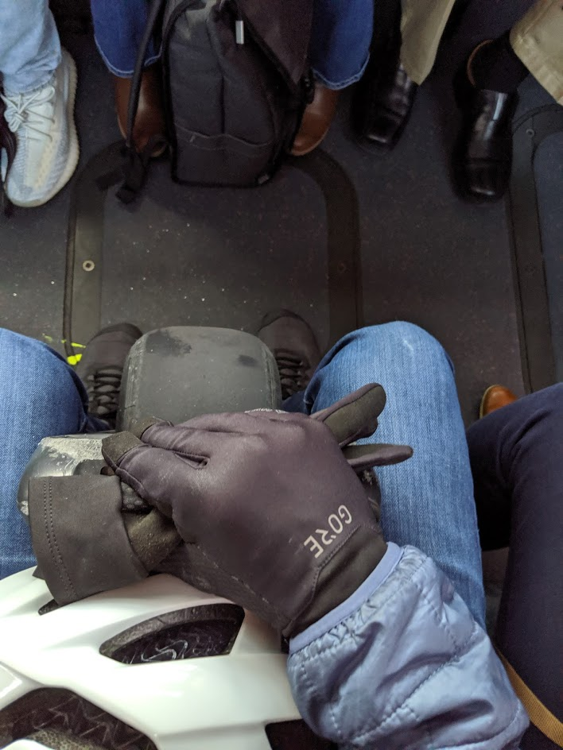
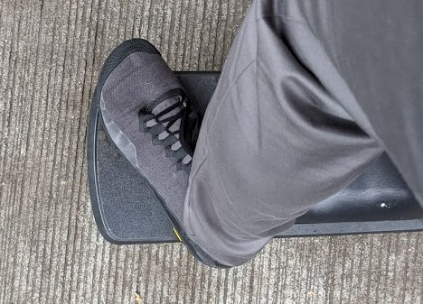

---
layout:	post
title:	"One Wheel Pint -An Honest Review"
date: 2020-01-02
excerpt: "I recently bought a OneWheel Pint to help speed up the last leg of my commute (a 20 minute walk, each way) from the end of the bus ride to the office and back. For this use, I think that it is good option for me, and would recommend it."
---

Commuting is a pain. My particular commute is a multi-stage, adventure that can take an hour on a decent day and mind boggling amounts of time if something goes wrong in Seattle traffic. My spouse and I start by carpooling to our day-care, drop off a kiddo, then catch a bus into downtown, and finally walk across town to my office. Most of the time it works just fine. But it doesn't take much to throw off the whole experience to a post-apocalyptic hell-scape of gridlock.  In the past several years, we've seen car accidents and trucks full of bees or fish completely stop the major high ways and all of the side streets.

I recently bought a OneWheel Pint to help speed up the last leg of my commute (a 20 minute walk, each way) from the end of the bus ride to the office and back. For this use, I think that it is good option for me, and would recommend it.

## TLDR

1. The Pint is a lot of fun to ride, I've been snowboarding most of my life and it feels very like that.
2. It has plenty of range to be a first and last mile solution connecting me to my bus from home and office.
3. The carry handle is good for carrying it onto the bus, and across the lobby and street; but don't plan on using it to carry the Pint across town if you run out of battery.
4. Get the fender.
5. Be prepared to get questions.

## The Ride

### Snowboarding on at the bottom of the hill

The best way to describe the ride is to say it feels like snowboarding on a nice day as you are getting to the bottom of the hill and things are leveling out as you come into the lift.  You take up that nice relaxed stance and coast, maybe a little faster than you should, but you feel like you are in control and you can stop as needed.

### The Brakes

One thing I love about the pint is that you can actively break just by leaning back. It feels very intuitive and is powerful enough to stop you, assuming you aren't going too fast, which on the pint you really can't.  As always you need to ride in control for the conditions, I slow down in the rain, because your stopping power is entirely dependent on a very small patch of rubber. As an additional plus, it charges the battery when you do break.  So if your coming down a big hill you actually end up with some extra juice at the bottom.

## Physical Things

### On the bus

The Pint is built to be small.  That is mostly very good for me. I find that it is small enough to carry on the bus and small enough to tuck under my desk at work. When I'm on the bus if I get a seat I can sometimes park it under the seat, or I can stand it upright between my legs and kep my legs inside the width of my own seat, and not stick out into the aisle.

### My big feet

One small down-size of the small size of the Pint is that it has a relatively small deck for your feet.  I wear size 12 shoes which means that my toes stick over the end side of the board almost anywhere I put my meet.  

### Weight

The pint feels pretty reasonable weight wise, and the carry handle is super helpful; but, there are zero ways to carry the pint that allow you to roll or drag it.  I think this is something that the Solo-Wheel or razor scooter style devices have an advantage, they each have carry handles that allow you to roll the device while not riding it. This is worth keeping in mind because there are places you definitely will need to carry the Pint around.

* Getting on and off the bus - requires you to pick it up and carry it down the bus.
* Walking across the lobby - I work in an office building that won't let me to ride through the lobby
* Curbs - The Pint does not curb jump, I've totally wiped out trying, it also absolutely can't go up a curb without a curb cut. Which by the way, has given me an enormous new level of appreciation for the difficulty that mobility challenged individuals must have navigating through the city. Many drivers and pedestrians will block the entrance or exit to a curb cut.  Drivers are usually pulled out into the intersection trying to make a turn, people are usually waiting for a light to turn so they can cross the intersection. For the me on the Pint this is annoying but easy to fix, I stop, pick up the pint and walk across the intersection.  But for someone in a wheelchair, walker, or other mobility challenge, you would just be stuck.

### Range

For my particular commute I find the Pint has plenty of range for my daily use case. I travel about 3 miles round trip each day, in a pinch or transportation apocalypse I can make it all the way to our daycare which is 5 miles away.  But I've learned twice not ot push it to far.  On two occasions I've charged the Pint at work, taken it to the bus in the evening, then in the morning tried to ride straight from day care all the way to the office.  That is a total trip of 7 miles, with a little bit of an incline on the way into the city. That unfortunately meant that I had to cary a heavy weight across the city.  Despite the handle, it's still not comfortable to carry much further than across the lobby of a building. And you look pretty silly carrying your electric scooter with a helmet on the sidewalk.

### Bumpy things

One thing that surprised me is how much the rounded wheel leaves means you feel lots of the texture of the road.  I've noticed that the board wobbles even on subtle things like raised painted lines on roads.

### Water

I live in Seattle, I ride the pint in the rain.  The [fender](https://onewheel.com/products/fender-pint) is an absolute must. My feet stay super dry, in fact drier than if I had walked on a rainy day.

### Be prepared for questions

This is absolutely a conversation starter, I get asked about it on the bus, in the bike lanes, around the office, random people on the street.  It's different and it stands out.  People will have questions about how it rides and how safe you feel (wear a helmet, I should probably have wrist guards).

## Navigating the city

### Bike-lanes, sharerows, and sidewalks

I'm a cyclist much more than I am a skateboarder.  To be perfectly honest, if I had my preferences, I would probably ride my bike to work every day rather than take a car, a bus and OneWheel. I'm familiar with the downtown bike lanes, and am generally comfortable riding my bike in most traffic conditions.  

I don't feel as comfortable on the Pint, maybe I'll get there over time, but between it's max speed (16 MPH) and not feeling as stable as I do on my bike, I don't like to ride in sharerows. If available I will a separated bike lane, other wise I will get up onto a sidewalk. In bike lanes I feel like can go fast enough to not be in the way of other users. On sidewalks I feel like I can go slow enough to crawl behind a little old ladies, and gawking tourists.

It's also important to remember that the Pint is essentially silent.  People walking and riding don't hear you coming, especially in a world when almost everyone has a set of earbuds in while they walk across the city. So being cautious about surprising people when you come up behind them.

### Yield to slower traffic

Particularly when I'm on the sidewalk, I work really hard to be courteous to other people.  I can move a lot faster than anyone walking, and therefore can afford to let other people go first. My mental model is to apply snowboard trail rules on the side walk.

> 1. The Golden Rule: Control! - Keep your speed in check, and always control your direction. Make sure you can stop and avoid any person or obstacle at all times.
> 2. Yield to Anyone ~~Downhill~~ Ahead of You! - Yield to persons ~~downhill~~ ahead, and choose a course that ensures their safety.
> 3. Free Up the Trail! - Only stop if you can be seen from above, and never obstruct the trail.
> 4. At Intersections, Yield to Persons ~~Uphill~~ on foot! - Yield to ~~skiers and riders uphill~~ walkers when entering a ~~trail~~, or at intersections.
> 5. ~~Help The Ski Patrol! If you’re involved in or witness an accident, remain at the scene and identify yourself to a first-aider.~~
> 6. No To Runaway Gear! - Always use and wear the appropriate device to prevent runaway equipment.
> 7. No Drugs, No Alcohol! - Do not use the ~~lifts or trails~~ _roads_ when under the influence of drugs or alcohol.
> 8. Obey the Signs! Obey all signs and warnings, and never venture off the trail or onto a closed trail.
